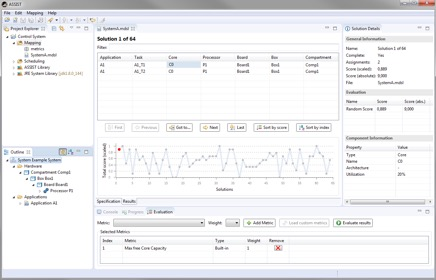

Architecture Synthesis for Safety-Critical Systems - ASSIST 
==============================================================

## Overview 

The ASSIST Tool Suite is designed for system engineers and system architects of safety-critical embedded systems or cyber-physical systems. ASSIST automates the deployment and scheduling from software components to hardware resources while respecting safety, reliability and timing requirements.

ASSIST has been initially developed as a proof of concept for the dissertation of Robert Hilbrich. Since its availability it was successfully used within several research projects with industrial partners from the aerospace and automotive domain.

## Downloads

Can be found [here](https://github.com/RobertHilbrich/assist-public/releases).

## Benefits

The benefits for the systems engineer are:

* Several resource configurations can be quickly analyzed for feasibility
* Conflicts in resource utilizations can be identified early in the development process
* Resources can be minimized with respect to the software requirements
* Resource requirements, resource capabilities and safety constraints are explicitly stated (no hidden links)
* The design space for possible hardware architectures and resource configurations can be explored very efficiently
* Resource utilization and deployment evaluation can be optimized with pre-defined or customizable metrics

## Motivation and Background

Microprocessors and networks in safety-critical systems can often be shared by several system functions. Sharing resources facilitates the consolidation of devices, so that space, weight and power requirements can be minimized. This is often called a multi function integration.

Software components are deployable entities which implement system functions and comprise of one or more threads. Their deployment to resources in the hardware platform plays an important role during the design of a safety-critical embedded system.

With the rising complexity of system architectures, increasing functional and non-functional requirements (safety, reliability, predictability) the manual construction of a deployment is no longer economically feasible.

The ASSIST Tool Suite aims to automate this challenging, error prone and complex task. It requires the user to specify:

* the resource requirements of the software components,
* the features and capabilities of the hardware components and
* safety and reliability requirements

in a textual domain specific language.

This specification of a deployment problem is automatically transfered into Constraint Satisfaction Problem (CSP). Solutions for the CSP represent correct deployments. They are automatically generated with the constraint solver [Choco](http://www.choco-solver.org). Solutions can also be evaluated and optimized based on pre-defined or customizable metrics.
